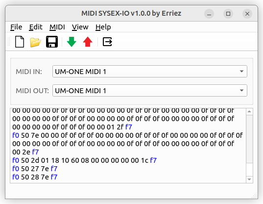

# MIDI SYSEX-IO

This Windows/Linux application receives/transmits instrument settings via MIDI 
SYSEX messages with a GUI or commandline.



The application was originally developed to load/save settings for a Technics 
KN2000 keyboard from 1993 and a Roland TD12 drum computer. Now it is generic 
enough to use it with other MIDI devices as well.

SYEXEX files with `.syx` extension are RAW MIDI files and are compatible with
MIDI-OX tool.

## Downloads

Visit the [release page](https://github.com/Erriez/midi-sysex-io/releases)
and download the standalone executable or setup.

**Windows:**:
* Run `erriez-midi-sysex-io.exe` as portable standalone application, or:
* Run `erriez-midi-sysex-io-setup.exe` to install on Windows (default:
  `C:\Program Files\Erriez\`) which creates a shortcut in the start menu and 
  desktop.

**Linux installer:**

No `sudo` rights are required as the executable is installed in the user's home 
directory `~/.local/bin/erriez/`:

```bash
# Add executable flag after download with command:
$ chmod +x erriez-midi-sysex-io-linux-setup.run
 
# Run setup:
$ ./erriez-midi-sysex-io-linux-setup.run

Press `q` to quit license.
Please type y to accept, n otherwise: y
...
```

Start the application via desktop menu | Accessories.

**Linux standalone application:**

The Linux standalone executable can be started directly without `sudo` or
installation:

```bash
# Add executable flag after download with command:
$ chmod +x erriez-midi-sysex-io-linux
 
# Start executable:
$ ./erriez-midi-sysex-io-linux
```

## Commandline usage

```bash
# Help
$ ./erriez-midi-sysex-io-linux --help
MIDI SYSEX-IO v1.0.0 by Erriez (c) 2023
usage: erriez-midi-sysex-io-linux [-h] [-o OPEN] [-t TRANSMIT] [-r RECEIVE]
                                  [-p PORT_ID] [-l] [-v]

options:
  -h, --help            show this help message and exit
  -o OPEN, --open OPEN  Open SYSEX file in GUI
  -t TRANSMIT, --transmit TRANSMIT
                        Transmit SYSEX commandline
  -r RECEIVE, --receive RECEIVE
                        Receive SYSEX commandline
  -p PORT_ID, --port-id PORT_ID
                        MIDI port ID for --transmit or --receive
  -l, --list-midi-ports
                        Print MIDI ports commandline
  -v, --verbose         Print verbose commandline

# List MIDI ports
$ ./erriez-midi-sysex-io-linux -l
MIDI SYSEX-IO v1.0.0 by Erriez (c) 2023
MIDI input ports:
  0: Midi Through Port-0
  1: UM-ONE MIDI 1
MIDI output ports:
  0: Midi Through Port-0
  1: UM-ONE MIDI 1
  
# Start GUI and open SYSEX file
$ ./erriez-midi-sysex-io-linux -o myfile.syx

# Transmit SYSEX file
$ ./erriez-midi-sysex-io-linux -p 1 --transmit file.syx
  
# Receive SYSEX and save to file
$ ./erriez-midi-sysex-io-linux -p 1 --receive file.syx
```

## Technical details

This project uses PySide6 [Python based Qt](https://www.qt.io/qt-for-python) 
which supports multiple desktop platforms. The developer of this repository 
Erriez only supports Windows and Linux.

When running from source, MIDI backend RTMIDI can be configured using
[python-rtmidi](https://pypi.org/project/python-rtmidi/) (default) or 
[PyGame](https://github.com/pygame/pygame) in `app_config.py`:

```bash
# Configure in app_config.py
USE_RTMIDI = 1 # Default
USE_PYGAME = 0
```

## Installation python-rtmidi

```bash
# Ubuntu/Debian
$ sudo apt install libasound2-dev libjack-dev

$ virtualenv --system-site-packages venv
$ . venv/bin/activate
$ pip install -r requirements.txt
```

## Optional: Installation PyGame

[Pygame PIP errors Ubuntu](https://github.com/pygame/pygame/issues/3756)

Install system-wide:

```bash
# Configure in app_config.py
USE_RTMIDI = 0
USE_PYGAME = 1

# Ubuntu/Debian
$ sudo apt install python3-pygame

$ virtualenv --system-site-packages venv
$ . venv/bin/activate
$ pip install -r requirements.txt
```

## Run
```
$ . venv/bin/activate
$ pip install -r requirements.txt
$ ./main.py
```

## False positives virusscanners

Windows Defender and virusscanners such as https://www.virustotal.com/ shows
false positives when building executable with Pyinstaller or Nuitka. This is a
known issue.

## MIT License

This project is published under [MIT license](https://github.com/Erriez/midi-sysex-io/blob/master/LICENSE)
with an additional end user agreement (next section).

## End User Agreement :ukraine:

End users shall accept the [End User Agreement](https://github.com/Erriez/midi-sysex-io/blob/master/END_USER_AGREEMENT.md)
holding export restrictions to Russia to stop the WAR before using this project.

## KN2000 format

```
RX (7): f0 50 21 01 18 10 f7 	-> Start
RX (7): f0 50 21 01 18 10 f7 
RX (7): f0 50 21 01 18 10 f7 

RX (40): f0 50 2d 01 18 10 40	-> Panel
...
RX (5): f0 50 27 7e f7

RX (40): f0 50 2d 01 18 10 30	-> Sound
...
RX (5): f0 50 27 7e f7

RX (40): f0 50 2d 01 18 10 50	-> Composer
...
RX (5): f0 50 27 7e f7

RX (40): f0 50 2d 01 18 10 60	-> Sequencer
...
RX (5): f0 50 27 7e f7

RX (5): f0 50 27 7e f7		-> End
```
